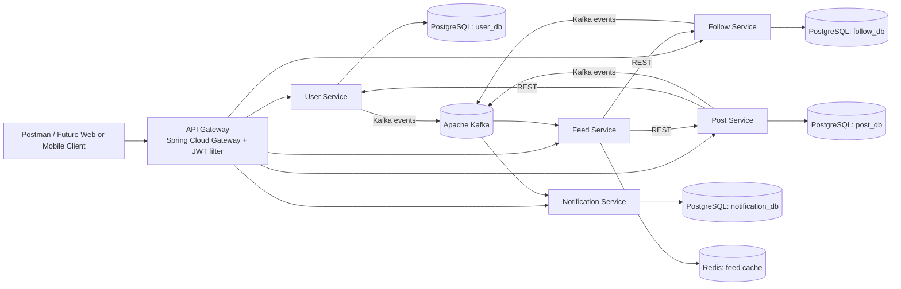

# ConnectSphere Architecture

## Overview

ConnectSphere uses a lean Spring Boot microservices architecture. Synchronous API requests flow through the Gateway and reach domain services over REST. Asynchronous domain events flow through Kafka to decouple feed invalidation and notification creation.

## Service ownership

- `user-service`: users, credentials, profiles, token issuance
- `post-service`: posts, likes, comments
- `follow-service`: follow graph
- `feed-service`: feed aggregation, cache reads, cache invalidation
- `notification-service`: notification persistence and retrieval
- `gateway-service`: routing and auth boundary

## API boundary

- External clients call only the Gateway in the intended deployment model.
- The Gateway validates JWTs and forwards trusted headers like `X-User-Id`.
- Service-to-service reads are REST-based for v1.
- Service-to-service async events use Kafka topics.

